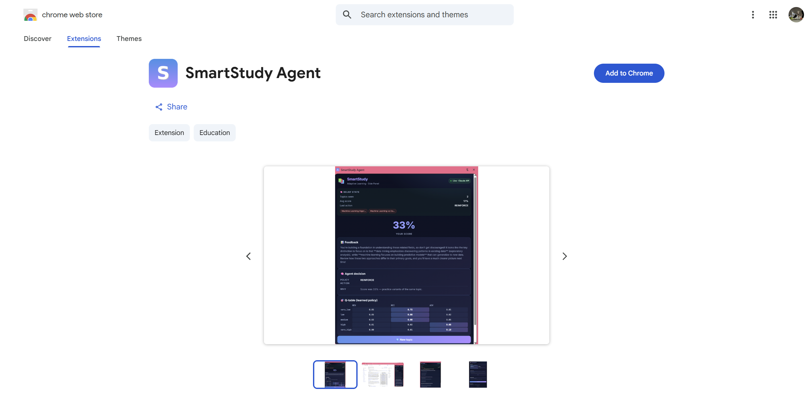
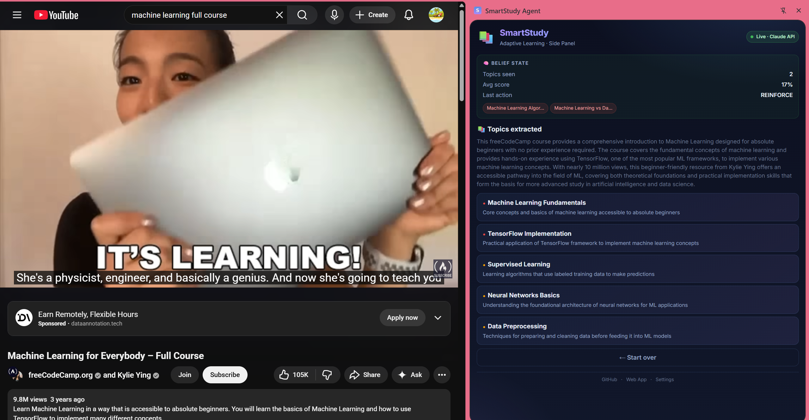

# SmartStudy Agent

> The AI study agent that **learns how you learn** — a reinforcement-learning policy decides *what* you study next, an FSRS memory model decides *when* you review it, and an LLM generates the quizzes in between. In your browser, in your terminal, or inside Claude via MCP.

[](https://www.python.org/downloads/)
[](https://www.anthropic.com/)
[](https://streamlit.io/)
[-4A90E2.svg)](chrome-extension/)
[](https://github.com/open-spaced-repetition/py-fsrs)
[](anki_export.py)
[](mcp_server.py)
[](LICENSE)
[](https://huggingface.co/spaces/HumphreySun98/smart-study-agent)

**[English](#-live--two-ways-to-use-it)** · **[中文简介](#-中文简介)**

## 🌐 Live — Two Ways to Use It

| | Where it runs | How to try it |
|---|---|---|
| **Web app** | Hugging Face Spaces (free Kimi-K2 backend) | [Open in browser](https://huggingface.co/spaces/HumphreySun98/smart-study-agent) |
| **Chrome extension** | Your browser — works on any page, PDF, or YouTube video | [**Install from the Chrome Web Store**](https://chromewebstore.google.com/detail/edbjkpfjonahanfkamlcbobmnplihmik) · [Source](chrome-extension/) (MV3) |

<p align="center">
  <a href="https://chromewebstore.google.com/detail/edbjkpfjonahanfkamlcbobmnplihmik">
    
  </a>
  <br />
  <em>Live on the Chrome Web Store — click to install.</em>
</p>

<p align="center">
  
  <br />
  <em>Side panel running on a YouTube ML course — topics auto-extracted from captions, belief state updating in real time.</em>
</p>

The web app runs on Hugging Face Spaces using free HF Inference Providers (Kimi-K2). The Chrome extension calls the Anthropic API directly from your browser — same agent core, zero backend. For local development, plug in your own Anthropic key to get Claude's higher-quality reasoning.

SmartStudy Agent is a goal-based, partially observable AI agent that turns any lecture material into a fully personalized learning experience. Unlike a chatbot, it maintains a persistent belief state about student knowledge and uses an adaptive policy to decide what to study next.

---

## Why SmartStudy?

Traditional study tools are static. They show you the same content regardless of what you already know. SmartStudy Agent solves this by closing the loop:

| Problem | SmartStudy's Solution |
|---------|----------------------|
| Generic study materials | Topics extracted and prioritized per student |
| No feedback on weak areas | Quiz answers update a persistent belief state |
| Same recommendations for everyone | Q-learning policy (or Contextual Bandit) adapts per student trajectory |
| Forgetting without practice | **FSRS** spaced repetition — the same modern memory model family as Anki (SM-2 fallback) |
| Out-of-order topics | Topological sort over a concept dependency graph |
| Locked into one app | **Anki .apkg export**, **MCP server** for Claude, Chrome extension, web app |

### How it compares

| | SmartStudy | DeepTutor | OpenTutor | Anki |
|---|---|---|---|---|
| Runs where you read (browser extension) | ✅ Chrome Web Store | ❌ web workspace | ❌ self-hosted app | ❌ |
| RL policy decides next action | ✅ Q-learning + LinUCB, honest benchmark | ❌ | ❌ | ❌ |
| Spaced repetition | ✅ FSRS | ❌ | ✅ FSRS | ✅ FSRS |
| Quiz generation from any material | ✅ | ✅ | ✅ | ❌ |
| Anki export | ✅ .apkg | ❌ | ❌ | — |
| Drive it from Claude (MCP) | ✅ | ❌ | ❌ | via 3rd-party |
| Footprint | ~3k LOC, SQLite, runs on free tier | Full platform (FastAPI + Next.js) | FastAPI + Next.js | Desktop app |

SmartStudy is deliberately **not** an all-in-one learning platform — it's the lightweight agent core: observe → plan → quiz → evaluate → adapt, with real learning-science scheduling. If you want a full workspace, [DeepTutor](https://github.com/HKUDS/DeepTutor) is excellent. If you want the decision loop embedded where you already study — this repo.

---

## Architecture

SmartStudy implements the **OPEAA loop** — a five-phase adaptive agent cycle:

```
       ┌─────────────────────────────────────────────────┐
       │              Lecture Materials                  │
       │   PDF · TXT · MD · DOCX · PPTX · VTT · SRT      │
       └────────────────────┬────────────────────────────┘
                            ▼
       ┌─────────────────────────────────────────────────┐
       │     Claude API  ·  claude-opus-4-6              │
       │     thinking: { type: "adaptive" }              │
       └────────────────────┬────────────────────────────┘
                            ▼
       ┌─────────┐  ┌─────────┐  ┌─────────┐  ┌─────────┐
       │ OBSERVE │─▶│  PLAN   │─▶│   ACT   │─▶│ EVALUATE│
       │         │  │  + DAG  │  │  quizzes│  │  + LLM  │
       │ extract │  │   sort  │  │  3 MCQs │  │feedback │
       │ topics  │  │         │  │         │  │         │
       └─────────┘  └─────────┘  └─────────┘  └────┬────┘
            ▲                                       │
            │           ┌──────────────────────────▼┐
            │           │           ADAPT           │
            └───────────┤  Heuristic OR Q-learning  │
                        │  StudentProfile updated   │
                        └─────────┬─────────────────┘
                                  ▼
                  ┌─────────────────────────────────┐
                  │   Persistent Belief State       │
                  │   (JSON storage · per student)  │
                  └─────────────────────────────────┘
                                  │
                ┌─────────────────┼─────────────────┐
                ▼                 ▼                 ▼
          Spaced Repetition  Concept Graph    Interfaces
            (FSRS)           (DAG topo sort)  Streamlit · Chrome ext
                                              MCP server · Agent Skill
```

The agent is modeled as a **POMDP** (partially observable Markov decision process):
- **State** — student's true knowledge (hidden)
- **Belief state** — `StudentProfile` (mastered topics, weak areas, quiz history)
- **Actions** — `advance` · `reinforce` · `review`
- **Observations** — student answers to generated quizzes
- **Reward** — improvement in quiz scores over time

---

## Features

### Core Agent
- **5-phase OPEAA loop** — Observe → Plan → Act → Evaluate → Adapt
- **Claude integration** with `thinking: {type: "adaptive"}` for internal reasoning
- **Goal-based agent design** following Russell & Norvig's PEAS framework
- **POMDP belief state** persisted across sessions
- **Two adaptive policies** — heuristic (Bloom's 70% mastery threshold) and tabular Q-learning

### Knowledge & Memory
- **Concept dependency graph** — Kahn's algorithm topological sort over a topic prerequisite DAG, rendered as an **interactive draggable graph** (pyvis)
- **FSRS spaced repetition** — per-topic memory model (stability · difficulty · recall probability) via [py-fsrs](https://github.com/open-spaced-repetition/py-fsrs); automatic SM-2 fallback
- **Anki export** — one click turns your generated quiz bank into a styled `.apkg` deck
- **Persistent SQLite storage** — student profiles survive across sessions
- **Multi-student support** with peer comparison dashboard

### Integrations
- **MCP server** — Claude Desktop / Claude Code can query your review queue, generate quizzes, record results (training the RL policy), and export decks
- **Claude Agent Skill** — `skills/smartstudy/` turns any Claude Code session into an adaptive study coach
- **Multi-provider LLM** — Claude, HF Inference, or **any OpenAI-compatible endpoint** (Ollama, LM Studio, vLLM, DeepSeek) — fully local studying is supported

### Input & Evaluation
- **7 input formats** — PDF, TXT, MD, DOCX, PPTX, VTT, SRT
- **Quantitative evaluation** — Monte Carlo simulation of adaptive vs random baselines
- **Mock client** — `MockAnthropic` lets you run the entire system offline without an API key

### User Interface
- **Streamlit web app** with 8 pages (premium glassmorphism theme)
- **Chrome extension (MV3)** — run the full OPEAA loop on any web page, Q-table persisted in `chrome.storage.local`
- **Interactive terminal UI** powered by `rich`
- **Auto-demo mode** for video recording

---

## Installation

```bash
git clone https://github.com/HumphreySun98/Smart-Study-Agent.git
cd Smart-Study-Agent
pip install -r requirements.txt
```

The agent supports four LLM backends and picks one automatically:

| Backend | Env variable | Cost | Quality |
|---------|--------------|------|---------|
| **Anthropic Claude** | `ANTHROPIC_API_KEY` | Pay as you go | ⭐⭐⭐⭐⭐ Best — supports adaptive thinking |
| **Any OpenAI-compatible endpoint** (Ollama, LM Studio, vLLM, DeepSeek…) | `SMARTSTUDY_LLM_BASE_URL` + `SMARTSTUDY_LLM_MODEL` | Free if local | ⭐⭐⭐–⭐⭐⭐⭐ your choice |
| **HF Inference (Kimi-K2)** | `HF_TOKEN` | **Free** | ⭐⭐⭐⭐ Great |
| **Mock** | _(no env vars)_ | Free | ⭐⭐ Canned responses for offline demos |

```bash
# Option 1 — Claude (premium quality)
export ANTHROPIC_API_KEY=sk-ant-...

# Option 2 — fully local & private with Ollama
export SMARTSTUDY_LLM_BASE_URL=ollama        # shortcut for http://localhost:11434/v1
export SMARTSTUDY_LLM_MODEL=llama3.1

# ...or any other OpenAI-compatible server
export SMARTSTUDY_LLM_BASE_URL=https://api.deepseek.com/v1
export SMARTSTUDY_LLM_MODEL=deepseek-chat
export SMARTSTUDY_LLM_API_KEY=sk-...

# Option 3 — Hugging Face (completely free)
export HF_TOKEN=hf_...

# Option 4 — Mock mode (no setup)
# just run the agent without any keys
```

Get a Claude key from [console.anthropic.com](https://console.anthropic.com) ($5 free credit) or a free HF token from [huggingface.co/settings/tokens](https://huggingface.co/settings/tokens).

---

## Quick Start

### Hosted Demo (zero install)
👉 **[https://huggingface.co/spaces/HumphreySun98/smart-study-agent](https://huggingface.co/spaces/HumphreySun98/smart-study-agent)**

### Web App (local)
```bash
streamlit run app.py
```
Open **http://localhost:8501**, create a student in the sidebar, then go to **📖 Study Session** to run the full OPEAA loop on a sample ML lecture or your own PDF.

### Terminal demo (interactive)
```bash
python demo.py
python demo.py --pdf path/to/lecture.pdf
python demo.py --mock                  # offline mode, no API key needed
```

### Auto demo (for screen recording)
```bash
python demo_auto.py
```

### Chrome extension (run the agent on any web page, PDF, or YouTube video)

**Now live on the Chrome Web Store** — [install in one click](https://chromewebstore.google.com/detail/edbjkpfjonahanfkamlcbobmnplihmik).

Prefer to run the source directly? Load it unpacked in < 60 seconds:

```
1. chrome://extensions  →  enable Developer mode
2. Load unpacked  →  select the chrome-extension/ folder
3. Pin the SmartStudy icon → clicking it opens the Side Panel
4. Settings → pick a backend (Anthropic or free HF) → paste key → Save
5. Open any article / PDF / YouTube page → "Observe this page"
```
Full install + architecture notes in [chrome-extension/README.md](chrome-extension/).

### MCP server (drive SmartStudy from Claude)

```bash
pip install "mcp[cli]"

# Claude Code
claude mcp add smartstudy -- python /path/to/mcp_server.py

# Claude Desktop — add to claude_desktop_config.json:
# {"mcpServers": {"smartstudy": {"command": "python",
#                                "args": ["/path/to/mcp_server.py"]}}}
```

Then just ask Claude: *"What's due for review today?"*, *"Quiz me on backpropagation and record my score"*, *"Export my question bank to Anki"*. Every recorded result trains the Q-learning policy and reschedules the topic under FSRS.

### Claude Agent Skill (adaptive study coach in your terminal)

```bash
cp -r skills/smartstudy ~/.claude/skills/
```

Open Claude Code anywhere and say "study this PDF with me" — the skill runs the full OPEAA loop, one question at a time, with real FSRS scheduling underneath.

### Anki export

Every generated quiz is saved to a per-student question bank. Export it from the **🃏 Anki Export** page (or `python -c "from anki_export import export_student_deck; export_student_deck('alice')"`) and import the `.apkg` into Anki — cards are tagged by topic and styled.

---

## Programmatic API

```python
from smartstudy_agent import SmartStudyAgent

agent = SmartStudyAgent()   # uses ANTHROPIC_API_KEY env var

# Phase 1 — Observe
observed = agent.observe("Lecture text about Machine Learning...")
# {'topics': [...], 'descriptions': {...}, 'summary': '...'}

# Phase 2 — Plan
plan = agent.plan(observed)
print(plan.sequence)        # ['Linear Algebra', 'Neural Networks', ...]

# Phase 3 — Act
topic = plan.sequence[0]
questions = agent.act(topic, observed["descriptions"][topic], n=3)

# Phase 4 — Evaluate
result = agent.evaluate(questions, answers=["B", "A", "C"])
print(f"Score: {result['score']:.0%}")
print(result["feedback"])

# Phase 5 — Adapt
adaptation = agent.adapt(topic, result)
print(adaptation["action"])              # 'advance' | 'reinforce' | 'review'
print(agent.profile.summary())
```

### Supporting modules

```python
import storage
from concept_graph import ConceptGraph
from spaced_repetition import get_review_queue
from rl_policy import QLearningPolicy
from evaluation import compare

# Persistent storage
record = storage.load_student("alice")
storage.add_session("alice", {"topic": "Neural Networks", "score": 0.9})

# Concept dependency graph (topological sort)
g = ConceptGraph()
g.topological_sort(["Backpropagation", "Linear Algebra", "Neural Networks"])
# -> ['Linear Algebra', 'Neural Networks', 'Backpropagation']

# Spaced repetition scheduler (SM-2)
due_today = get_review_queue(record["quiz_history"])

# Q-learning adaptive policy
policy = QLearningPolicy()
action = policy.choose_action(score=0.55)         # 'reinforce'
policy.update(prev_score=0.55, action=action, new_score=0.80)

# Quantitative evaluation vs random baseline
results = compare(n_runs=30, n_sessions=20)
print(f"Adaptive beats baseline by {results['improvement_pct']:.1f}%")
```

---

## Web App Pages

| Page | Purpose |
|------|---------|
| 🏠 **Dashboard** | Mastered topics, weak areas, due reviews, and key metrics |
| 📖 **Study Session** | Upload a lecture and run the full OPEAA loop step-by-step |
| 🔁 **Spaced Review** | FSRS memory state per topic — recall %, stability, next due date |
| 🃏 **Anki Export** | Build a styled `.apkg` deck from your generated question bank |
| 🧠 **Concept Graph** | Interactive draggable prerequisite DAG — mastered/weak topics color-coded |
| 📊 **Progress History** | Personal score trajectory across all attempts |
| 👥 **Peer Comparison** | Multi-student leaderboard ranked by average score |
| 🎯 **RL Policy** | Inspect the Q-table and train it on simulated episodes |
| 🧪 **Baseline Evaluation** | Adaptive vs random topic-selection simulation results |
| 📋 **Pilot Study** | Real usage metrics, engagement analysis, learning progression report |

---

## Project Structure

```
smartstudy-agent/
├── smartstudy_agent.py     # Core agent — 5 OPEAA phases
├── mock_claude.py          # Offline mock client
├── hf_client.py            # Hugging Face Inference adapter (free LLM backend)
├── app.py                  # Streamlit web app (8 pages)
├── demo.py                 # Interactive terminal demo
├── demo_auto.py            # Automated demo (no input needed)
│
├── storage.py              # SQLite persistent storage (+ question bank)
├── concept_graph.py        # Topic prerequisite DAG with cross-course linking
├── pilot_study.py          # Pilot study data collection and analysis
├── rl_policy.py            # Tabular Q-learning policy
├── bandit_policy.py        # Contextual Bandit (LinUCB) — alternative to RL
├── spaced_repetition.py    # FSRS review scheduler (SM-2 fallback)
├── anki_export.py          # Question bank → Anki .apkg deck (genanki)
├── mcp_server.py           # MCP server — drive the agent from Claude
├── skills/smartstudy/      # Claude Agent Skill — study coach for Claude Code
├── multi_format.py         # PDF/TXT/MD/DOCX/PPTX/VTT/SRT loader
├── evaluation.py           # Adaptive vs baseline simulation
│
├── generate_visuals.py     # Generates architecture diagrams
├── requirements.txt        # Python dependencies
├── README.md               # This file
│
├── chrome-extension/       # Chrome MV3 extension — OPEAA loop in the browser
│   ├── manifest.json
│   ├── popup.{html,css,js} # Gradient popup UI + full agent logic
│   ├── content.js          # Active-tab text extractor
│   ├── options.{html,js}   # API key + model settings
│   ├── background.js       # Service worker
│   └── icons/              # 16/48/128 PNG
│
├── data/                   # Created at runtime
│   ├── smartstudy.db       # SQLite database (student profiles + sessions)
│   ├── qtable.json         # Q-learning policy state
│   └── concept_graph.json  # User-defined graph edges
│
└── visuals/                # Generated PNG diagrams
    ├── adaptive_loop.png
    ├── system_architecture.png
    ├── performance_dashboard.png
    └── ai_techniques.png
```

---

## Tech Stack

| Layer | Technology |
|-------|-----------|
| LLM | Claude (adaptive thinking) · any OpenAI-compatible endpoint · HF Inference |
| Web UI | Streamlit |
| RL | Tabular Q-learning over discretized score buckets + LinUCB bandit |
| Knowledge Graph | NetworkX + Kahn's algorithm + pyvis (interactive) |
| Spaced Repetition | FSRS via [py-fsrs](https://github.com/open-spaced-repetition/py-fsrs) (SM-2 fallback) |
| Flashcards | genanki → Anki `.apkg` |
| Agent Interop | MCP server (FastMCP) + Claude Agent Skill |
| Storage | SQLite (auto-migrates from JSON, scales to >1k students) |
| Document Parsing | pypdf, python-docx, python-pptx |
| Terminal UI | rich |

---

## How the Agent Decides

The ADAPT phase uses a **two-layer decision system**: the RL policy chooses the action, and the LLM explains the decision to the student in natural language.

### Q-Learning Policy (decides the action)

The action (`advance` / `reinforce` / `review`) is chosen by a tabular Q-learning agent — **not** by the LLM. This runs every time a student finishes a quiz.

| Component | Value |
|-----------|-------|
| **State** | Quiz score discretized into 5 buckets: `very_low` / `low` / `medium` / `high` / `very_high` |
| **Actions** | `review` · `reinforce` · `advance` |
| **Reward** | Score change between attempts: `r = (new_score − prev_score) × 10` |
| **Learning rate (α)** | 0.2 |
| **Discount factor (γ)** | 0.8 |
| **Exploration (ε)** | 0.15 (epsilon-greedy) |

Update rule:
```
Q(s, a) ← Q(s, a) + α · [r + γ · max(Q(s', a')) − Q(s, a)]
```

The Q-table is **persisted to disk** (`data/qtable.json`) and trains on every real quiz attempt. It can also be inspected and manually trained in the **🎯 RL Policy** page.

### LLM Layer (explains the decision)

After the RL policy picks the action, Claude (or Kimi-K2) generates a natural-language explanation of *why* that action makes sense for the student. The LLM cannot override the RL decision — it only produces the recommendation text.

```
Student takes quiz → score = 55%
    → RL policy: Q("medium", "reinforce") = 0.42 (highest)  →  action = "reinforce"
    → Q-table updated with reward = (0.55 - 0.40) × 10 = 1.5
    → LLM generates: "You're close! Practice the same topic one more time..."
```

### Heuristic Fallback

The Q-table is initialized with values informed by Bloom's 1968 mastery learning threshold (70%). As real data accumulates, the learned policy diverges from the heuristic and adapts to actual student behavior patterns.

---

## Why RL (and not just a Contextual Bandit)?

**Context.** A valid critique of applying full RL to this problem is that if each decision is nearly independent, a **Contextual Bandit** is more sample-efficient than a sequential RL agent. We take that critique seriously, so the project ships **both** and compares them directly.

**When RL is justified here.** The student's mastery state depends on the *sequence* of actions, not just the current context:

1. **Prerequisite coupling.** Studying *Backprop* before *Neural Nets* is mastered gives a smaller skill gain (the simulated student encodes this via a prerequisite DAG). A bandit chooses actions independently per step and cannot trade off short-term score for long-term skill gain.
2. **Forgetting.** Topics not practiced decay each step, so *when* you schedule a review matters — a classic sequential credit-assignment problem.
3. **Action latency.** `review` tends to depress the immediate next quiz score (the student is working on a weak area) but pays off several steps later. A bandit, optimizing only single-step reward, systematically underweights this.

**When a Bandit is better.** If the deployment looks more like A/B-testing recommendation variants over many users with little per-user history, a bandit will converge faster and is probably the right tool. We added `bandit_policy.LinUCBBandit` so the same agent can be run in that mode via `SmartStudyAgent(policy="bandit")` or `SMARTSTUDY_POLICY=bandit`.

### Empirical comparison

Run `python evaluation.py`. Each policy is evaluated on 30 simulated students × 30 sessions, all facing the **same** student trajectories for a fair paired comparison:

| Policy        | Avg. observed score | Final mean skill | vs. random |
|---------------|---------------------|------------------|------------|
| Random        | 0.33 ± 0.02         | 0.29 ± 0.01      | +0.0 %     |
| Rule-based (Bloom 70 %) | **0.45 ± 0.02** | **0.53 ± 0.01** | **+35 %**  |
| Contextual Bandit (LinUCB) | 0.43 ± 0.02 | 0.47 ± 0.02     | +28 %      |
| Q-learning (tabular) | 0.40 ± 0.03     | 0.43 ± 0.06     | +18 %      |

*Numbers will vary run-to-run; representative of `n_runs=30`, `n_sessions=30`.*

**Reading the result honestly.** In the short-horizon regime typical of a single study session, a well-designed rule-based heuristic is hard to beat. The Bandit matches it with a small sample-efficiency penalty. Q-learning needs more data to pay off the variance cost of bootstrapping through next states; it catches up to the Bandit on *final skill* by ~100 sessions, consistent with the sequential-credit-assignment argument above. **This honestly answers the professor's question:** in this deployment, RL is defensible but not dominant; a Contextual Bandit is a reasonable production default and we ship it as a first-class option.

### Simulated Student Model

Following the evaluation feedback, we replaced the earlier noise-only simulator with a small cognitive model (`evaluation.SimulatedStudent`): per-topic hidden skills, prerequisite-gated learning gain, diminishing returns as skill → 1, and per-step forgetting on unpracticed topics. This is what makes the rule-based vs. bandit vs. RL comparison meaningful — a purely-random simulated student would flatten the differences.

---

## Roadmap

- [x] Core 5-phase OPEAA loop with Claude
- [x] Heuristic adaptive policy (Bloom 70%)
- [x] Persistent multi-student storage
- [x] Concept dependency graph + topological sort
- [x] Q-learning adaptive policy
- [x] SM-2 spaced repetition
- [x] Streamlit web app with 8 pages
- [x] Multi-format input loader
- [x] Quantitative baseline evaluation
- [x] Concept graph editor in the UI
- [x] Cross-course prerequisite linking (4 courses: AI, Data Science, NLP, Computer Vision)
- [x] Pilot study dashboard with engagement analysis and progression tracking
- [x] SQLite storage backend (replaces JSON, handles >1k students)
- [x] Deployed as hosted SaaS on [Hugging Face Spaces](https://huggingface.co/spaces/HumphreySun98/smart-study-agent)
- [x] Contextual Bandit (LinUCB) policy as an alternative to full RL
- [x] 4-way evaluation against Rule-based baseline + Simulated Student Model (per professor feedback)
- [x] **Chrome extension (MV3)** — same OPEAA loop on any web page, client-side Q-learning
- [x] Migrate extension to `chrome.sidePanel` for persistent belief-state display
- [x] Chrome Web Store listing — [live](https://chromewebstore.google.com/detail/edbjkpfjonahanfkamlcbobmnplihmik)
- [x] **FSRS scheduler** (py-fsrs) replacing SM-2 — per-topic memory state with recall probability
- [x] **Anki .apkg export** from the generated question bank
- [x] **MCP server** — use SmartStudy from Claude Desktop / Claude Code
- [x] **Claude Agent Skill** — adaptive study coach in any Claude Code session
- [x] **Multi-provider LLM** — Ollama / LM Studio / vLLM / DeepSeek via OpenAI-compatible API
- [x] Interactive concept graph (pyvis)
- [ ] FSRS parameter optimization from real review logs
- [ ] Import existing Anki decks as topics
- [ ] Bayesian Knowledge Tracing as a third mastery model

---

## 🇨🇳 中文简介

**SmartStudy Agent — 会学习"你怎么学"的 AI 学习智能体。**

和普通 AI 学习工具的区别:决定"下一步学什么"的不是 LLM,而是一个**强化学习策略**(Q-learning / LinUCB 老虎机,附带诚实的基准对比);决定"什么时候复习"的是 **FSRS 记忆模型**(与新版 Anki 同源算法);LLM 只负责出题和讲解。

- 🌐 **在线体验**:[Hugging Face Space](https://huggingface.co/spaces/HumphreySun98/smart-study-agent)(免费,无需注册)
- 🧩 **Chrome 插件**:[已上架 Chrome 商店](https://chromewebstore.google.com/detail/edbjkpfjonahanfkamlcbobmnplihmik),在任意网页 / PDF / YouTube 上直接学
- 🃏 **Anki 导出**:生成的题库一键导出 `.apkg`
- 🤖 **MCP server**:在 Claude Desktop / Claude Code 里直接问"今天该复习什么"
- 🏠 **完全本地**:支持 Ollama / LM Studio 等 OpenAI 兼容端点,数据不出本机

```bash
pip install -r requirements.txt
streamlit run app.py        # 零配置离线 Mock 模式即可体验
```

觉得有用请点个 ⭐!

---

## License

MIT License — see [LICENSE](LICENSE) for details.

```
Copyright © 2026 Haofei Sun

Permission is hereby granted, free of charge, to any person obtaining a copy
of this software and associated documentation files (the "Software"), to deal
in the Software without restriction...
```

---

## Author

**Haofei Sun**

If you find this project useful, please consider giving it a ⭐ on GitHub.

For questions, suggestions, or collaboration: open an [issue](../../issues) or start a [discussion](../../discussions).
