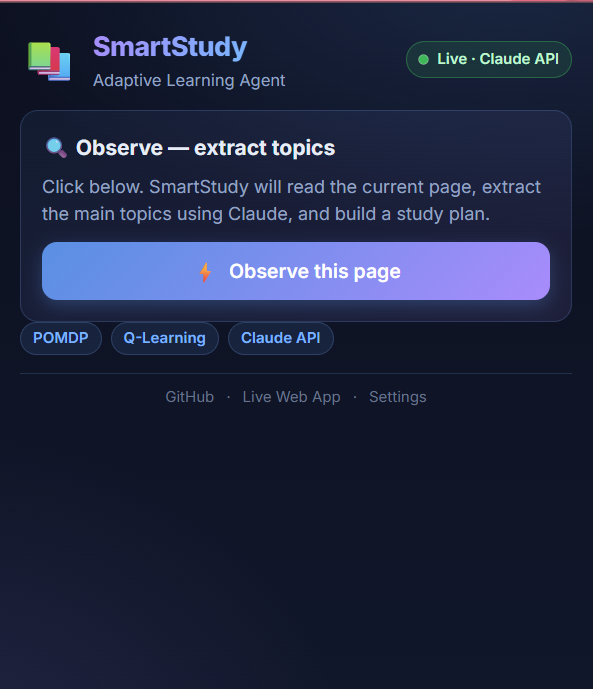

# SmartStudy Agent — Chrome Extension

Turns any web page into a **personalized quiz** powered by an adaptive AI tutor.
Same OPEAA closed-loop reasoning cycle as the [web app](https://huggingface.co/spaces/HumphreySun98/smart-study-agent) — delivered as a Chrome extension so you study **where you already are**.

  

  

---

## What it does

One click on any article / docs / Wikipedia / Coursera lecture / blog post →

1. **Observe** – Content script scrapes the visible page text
2. **Plan** – Claude extracts 4-6 key topics + priorities
3. **Act** – Click any topic to generate a 3-question MCQ
4. **Evaluate** – Score + LLM-generated feedback
5. **Adapt** – Tabular **Q-learning policy** (persisted in `chrome.storage.local`)
   decides whether to *advance*, *reinforce*, or *review* — and learns across sessions

Zero backend. Fully client-side. API key stays in your browser.

---

## Install (unpacked, < 60 seconds)

1. Clone this repo locally.
2. Open Chrome and go to [`chrome://extensions`](chrome://extensions).
3. Toggle **Developer mode** (top-right).
4. Click **Load unpacked** → pick the `chrome-extension/` directory.
5. Pin the SmartStudy icon to your toolbar.

First launch opens the **Settings** tab — paste your Anthropic API key
from [console.anthropic.com/settings/keys](https://console.anthropic.com/settings/keys).
Key is stored only in `chrome.storage.local` on your machine.

---

## Usage

1. Open any page with actual content (article, docs, Wikipedia, etc.)
2. Click the SmartStudy icon → **Observe this page**
3. Pick a topic → answer the quiz → see the **Agent decision**
4. Open settings → **Reset Q-table** to clear learned state

---

## Architecture

| Layer | Tech |
|-------|------|
| UI | Vanilla HTML/CSS/JS with gradient glassmorphism theme (Inter font) |
| Page extraction | Content script injected via `chrome.scripting.executeScript` |
| LLM | Direct call to `api.anthropic.com` with `anthropic-dangerous-direct-browser-access` |
| Policy | Tabular **Q-learning** over 5 score buckets × 3 actions |
| Persistence | `chrome.storage.local` for API key + Q-table |
| Permissions | `activeTab`, `scripting`, `storage` + host permission for Anthropic API |

---

## Privacy

- Your API key is stored only in `chrome.storage.local` — never transmitted anywhere except directly to Anthropic.
- Page content is sent to Anthropic for topic extraction and quiz generation.
- Nothing is sent to any SmartStudy-controlled server.
- Uninstall the extension to wipe all local data.

---

## Roadmap

- [x] MVP popup with full OPEAA loop
- [x] Persistent Q-table across sessions
- [ ] Migrate to `chrome.sidePanel` for persistent belief-state display
- [ ] PDF viewer integration (`chrome-extension://...pdf.js`)
- [ ] YouTube transcript extraction
- [ ] Multi-backend: add Kimi-K2 via HF router
- [ ] Chrome Web Store listing

---

## Known limitations (v0.1.0)

- `file://` and `chrome://` URLs are blocked by Chrome for content-script injection.
- Pages with infinite scroll return only the initially-rendered text.
- The extension calls Anthropic directly from the browser — this is fine for personal use but a production deployment should proxy through a server to keep the key off the client.

---

Part of [Smart-Study-Agent](https://github.com/HumphreySun98/Smart-Study-Agent) · MIT License
