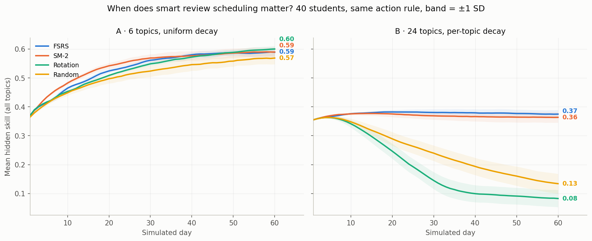

# SmartStudy Agent — Technical Deep Dive

*How a study agent actually decides: POMDP framing, a learned decision layer
(tabular Q-learning vs LinUCB), an FSRS memory model, and the experiments —
including the ones we lost.*

All numbers in this document are reproducible from this repo (commands at the
end). Where a learned method loses to a heuristic, we say so.

---

## 1. The problem, formalized

"What should this student do for the next 20 minutes?" is a **sequential
decision problem under partial observability**. We model it as a POMDP:

| POMDP element | SmartStudy instantiation |
|---|---|
| Hidden state $s$ | per-topic skill vector $\theta \in [0,1]^K$ — never directly observable |
| Actions $a$ | (topic, intervention) where intervention ∈ {`review`, `reinforce`, `advance`} |
| Observation $o$ | quiz score $o = \mathrm{clip}(\theta_{topic} + \varepsilon)$, $\varepsilon \sim \mathcal N(0, \sigma^2)$ — a *noisy, partial* readout of one coordinate of $\theta$ |
| Transition $T$ | studying raises $\theta_{topic}$ (gated by prerequisites, diminishing returns); unpracticed topics decay |
| Reward $r$ | improvement in observed mastery (a *proxy* — see Limitations) |
| Belief state $b$ | `StudentProfile`: mastered set, weak set, full quiz history |

Two design consequences fall straight out of this framing:

1. **A quiz is an observation, not an assessment.** Its job is to reduce
   uncertainty about $\theta$, which is why the agent quizzes *before* it
   plans, and why 3 questions are enough — we need a signal, not a grade.
2. **The belief state is the product.** Everything persistent in SmartStudy
   (SQLite profile, quiz history, FSRS memory states) is an approximate
   sufficient statistic for $\theta$. We do not maintain a full posterior;
   we keep last-observed scores plus FSRS memory parameters per topic. This
   is a point-estimate compromise, chosen deliberately (see §7).

**Why the LLM doesn't decide.** The LLM (Claude / Kimi-K2 / your Ollama
model) generates *content*: topic extraction, questions, explanations. The
*decision* — what to do next — is made by a small, deterministic, inspectable
policy. LLM sampling temperature should not decide your study plan twice
differently for the same state. Separating the stochastic generator from the
decision layer keeps the loop auditable: you can print the entire policy
(15 Q-values) and diff it after every update.

---

## 2. Decision layer: three policies, honestly compared

### 2.1 Tabular Q-learning

State = last observed score, discretized into 5 buckets
(`very_low < 0.3 ≤ low < 0.5 ≤ medium < 0.7 ≤ high < 0.9 ≤ very_high`).
Action ∈ {`review`, `reinforce`, `advance`}. The whole policy is a 5×3 table.

$$Q(s,a) \leftarrow Q(s,a) + \alpha\left[r + \gamma \max_{a'} Q(s',a') - Q(s,a)\right]$$

with $r = 10\,(o_{t+1} - o_t)$, $\alpha=0.2$, $\gamma=0.8$, $\varepsilon$-greedy
exploration at $0.15$. The table persists to `data/qtable.json` and trains on
every real quiz.

Why tabular, when everyone wants a neural policy? Sample size. A student
generates tens of decisions per week, not millions. A 15-parameter table
learns from dozens of episodes, can be printed in a README, and cannot
hallucinate. The interesting question is not "why so small" but "does even
this much learning beat a rule?" — see §2.4.

### 2.2 LinUCB contextual bandit

The critique we take seriously: *if consecutive decisions are nearly
independent, full RL pays a bootstrap-variance tax for nothing, and a
contextual bandit is more sample-efficient.* So we ship one.

Per action $a$, LinUCB maintains a ridge regression $A_a = I + \sum x x^\top$,
$b_a = \sum r\,x$, and picks

$$a^* = \arg\max_a \left(\hat\theta_a^\top x + \alpha\sqrt{x^\top A_a^{-1} x}\right),
\qquad \hat\theta_a = A_a^{-1} b_a$$

The context $x \in \mathbb R^{16}$: one-hot score bucket (5), one-hot topic
(8), raw score, log-scaled attempt count, bias. The second term is the
exploration bonus — wide confidence ellipsoid ⇒ try it.

### 2.3 Rule-based (the baseline that refuses to die)

Bloom's mastery-learning threshold: score < 0.5 → `review`, < 0.7 →
`reinforce`, else `advance`, weakest topic first. Zero parameters learned.

### 2.4 Results (fresh run, 30 simulated students each, paired seeds)

Simulator: hidden per-topic skills, prerequisite-gated learning gain,
diminishing returns, per-step forgetting (`evaluation.SimulatedStudent`).

**30 sessions (one exam's worth of studying):**

| Policy | Avg observed score | Final mean skill | vs random |
|---|---|---|---|
| Random | 0.336 ± 0.019 | 0.288 ± 0.012 | — |
| **Rule-based (Bloom 70%)** | **0.459 ± 0.023** | **0.530 ± 0.015** | **+36.6%** |
| LinUCB bandit | 0.429 ± 0.024 | 0.467 ± 0.018 | +27.7% |
| Q-learning | 0.400 ± 0.038 | 0.434 ± 0.060 | +19.1% |

**100 sessions (a semester):**

| Policy | Avg observed score | Final mean skill | vs random |
|---|---|---|---|
| Random | 0.246 ± 0.019 | 0.126 ± 0.025 | — |
| **Rule-based** | **0.538 ± 0.015** | 0.513 ± 0.078 | **+118.9%** |
| LinUCB bandit | 0.471 ± 0.033 | **0.507 ± 0.071** | +91.5% |
| Q-learning | 0.421 ± 0.083 | 0.441 ± 0.132 | +71.5% |

Honest reading:

- **The rule-based heuristic wins in this simulator, at both horizons.** A
  well-chosen domain heuristic encodes exactly the structure (mastery
  threshold) the simulator rewards. This is the expected outcome for
  low-dimensional, well-understood dynamics, and we refuse to bury it.
- **The bandit is the best learned policy** and essentially ties the rule on
  final skill by 100 sessions (0.507 vs 0.513, overlapping intervals) —
  consistent with the sample-efficiency argument: no bootstrapping through
  next-state values, so far less variance (±0.033 vs ±0.083 on score).
- **Tabular Q-learning trails and is the highest-variance policy.** An
  earlier run of ours suggested it "catches up by ~100 sessions"; this
  fresh, larger comparison does not reproduce that, so we've corrected the
  claim. Three plausible causes: (i) the reward $10\,\Delta$score is myopic
  and noisy, (ii) 5 score buckets alias very different knowledge states,
  (iii) $\gamma\,\max_{a'} Q$ bootstraps noise early in training.
- **Why keep RL in the product at all?** Because the deployment regime
  differs from the simulator: real students have longer horizons, stronger
  action latency (a `review` today pays off next week), and the Q-table
  continues to train on *real* quiz outcomes per deployment. The honest
  claim is "learned policies are competitive and keep improving," not "RL
  beats everything."

---

## 3. Memory layer: FSRS

### 3.1 The model

FSRS (Free Spaced Repetition Scheduler — the algorithm family behind modern
Anki) models each item with three quantities (DSR):

- **Stability $S$** — the interval (days) at which recall probability decays
  to 90%.
- **Difficulty $D$** — how much stability grows per successful review.
- **Retrievability $R(t)$** — probability of recall $t$ days after review,
  a power-law:

$$R(t) = \left(1 + F\,\frac{t}{S}\right)^{-c}, \qquad R(S) \equiv 0.9$$

Power-law, not exponential — that is the empirical shape of human forgetting
at scale (the parameters are fit on hundreds of millions of real reviews;
constants live in [py-fsrs](https://github.com/open-spaced-repetition/py-fsrs)).
A successful review multiplies $S$ (spacing effect); a lapse collapses it.
Compare SM-2, which tracks a single scalar "easiness" and multiplies
intervals by it — no explicit memory model, no recall probability.

### 3.2 Integration: stateless replay

SmartStudy maps quiz scores to FSRS ratings
(`<0.5 → Again, <0.7 → Hard, <0.9 → Good, else Easy`) and — the design
decision worth stealing — **stores no FSRS state at all**. Each topic's
memory state is recomputed by replaying its quiz history through the
scheduler on demand:

```
history (SQLite, append-only) --replay--> {S, D, R(now), due} per topic
```

Cost: O(history) per query — microseconds at human scale (a heavy user
logs maybe 10³ reviews/year). Benefit: no schema migration when FSRS
updates its parameters, no state-drift bugs, perfect reproducibility of
"what would the schedule have been." The review queue sorts due topics by
$R$ ascending — weakest memories first.

---

## 4. Experiment: does the scheduler even matter?

Everyone ships spaced repetition; nobody measures what it buys. We isolate
the scheduler: **same simulated student, same action rule, one study slot
per day — the only difference is which topic gets the slot.**

Contenders: FSRS (due + lowest $R$ first) · SM-2 (stateful E-factor due
dates) · Rotation (round-robin — the "just cycle through your notes"
strategy) · Random.

Two regimes, 40 students × 60 days each:



**Regime A — 6 topics, uniform decay (a single course):**

| Scheduler | Final mean skill |
|---|---|
| Rotation | **0.600 ± 0.011** |
| SM-2 | 0.590 ± 0.017 |
| FSRS | 0.589 ± 0.015 |
| Random | 0.569 ± 0.021 |

**Scheduling does not matter here — and that's the finding.** With 10
slots per topic and homogeneous forgetting, round-robin *is* near-optimal
coverage; the fancy schedulers merely match it. If your course has six
topics, your scheduler is not your bottleneck.

**Regime B — 24 topics, per-topic decay ∈ U[0.002, 0.06] (real corpus):**

| Scheduler | Final mean skill |
|---|---|
| **FSRS** | **0.375 ± 0.015** |
| SM-2 | 0.364 ± 0.018 |
| Random | 0.134 ± 0.034 |
| Rotation | 0.083 ± 0.030 |

Now the ordering inverts violently. With 2.5 slots per topic and
heterogeneous decay:

- **Rotation collapses below random.** Its revisit interval (24 days) exceeds
  the fast topics' survival time, so it pays full price on every topic and
  saves none; random at least revisits some topics early by luck.
- **Due-date schedulers triage.** They abandon the idea of covering
  everything and concentrate slots where memory is about to fail —
  **4.5× the retention of rotation.**
- **FSRS ≈ SM-2 within noise** (0.375 ± 0.015 vs 0.364 ± 0.018). We report
  the tie. Note the simulator's forgetting is *linear* while FSRS assumes
  power-law decay — the deck is stacked against FSRS here, and it still
  doesn't lose. Its documented wins over SM-2 come from parameter fitting
  on real review logs, which this simulation can't capture.

The design lesson: **spaced repetition is a triage algorithm, and triage
only matters under scarcity.** Its value scales with (volume of material ×
variance of decay) / review capacity.

---

## 5. Concept graph: the third constraint

Neither the policy nor the scheduler knows that Backprop before Neural Nets
is wasted effort. A prerequisite DAG (Kahn's-algorithm topological sort)
constrains the plan ordering; the simulator reciprocally gates learning
rate by the weakest prerequisite ($\sqrt{\min_p \theta_p}$), which is what
gives sequencing decisions long-term consequences in the evaluation.

---

## 6. The OPEAA loop, end to end

```
OBSERVE   LLM extracts topics from material          (content)
PLAN      priorities + DAG topological sort           (structure)
ACT       LLM generates 3 MCQs on the chosen topic    (content)
EVALUATE  deterministic scoring + LLM feedback text   (observation)
ADAPT     policy picks review/reinforce/advance;      (decision — no LLM)
          FSRS reschedules; belief state persists
```

One iteration = one quiz = one observation = one policy update. The loop is
the unit of everything: the Streamlit app walks it interactively, the Chrome
extension runs it on whatever page you're reading, the MCP server exposes
each phase as a tool so Claude can drive it conversationally.

---

## 7. Limitations (read before citing)

1. **Simulated students.** All comparative numbers use a synthetic cognitive
   model. It has the right qualitative structure (hidden skill, noise,
   prerequisites, forgetting) but real students are not i.i.d. draws from it.
   The pilot-study dashboard collects real usage; n is small.
2. **Point-estimate belief.** We track last scores + FSRS states, not a
   posterior over $\theta$. A Bayesian Knowledge Tracing layer is the
   natural upgrade (roadmap).
3. **Myopic reward.** $10\,\Delta$score rewards immediate improvement; the
   true objective is retention at exam time. The scheduler experiment
   measures the right thing (final skill); the policy comparison partially
   doesn't. Aligning them is future work.
4. **FSRS parameters are stock.** Per-user fitting from review logs
   (the thing that makes FSRS shine in Anki) is not implemented yet.
5. **The rule-based baseline is tuned to the simulator's mastery threshold.**
   Its dominance may not transfer to real students; that's precisely why the
   learned policies stay in the product and keep training on real data.

---

## 8. Reproduce everything

```bash
pip install -r requirements.txt

python evaluation.py                          # 4-policy comparison (§2.4)
python experiments/scheduler_comparison.py    # scheduler study + figure (§4)
python demo.py --mock                         # full OPEAA loop, no API key
```

Every experiment is pure Python with fixed seeds; runtime is seconds on a
laptop. If you get materially different numbers, open an issue — that's a
bug in our claims, and we want it on the record.
